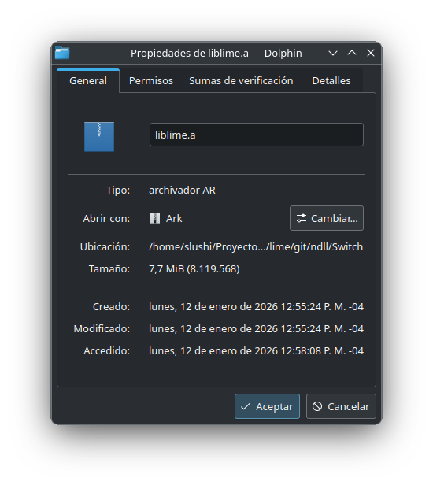
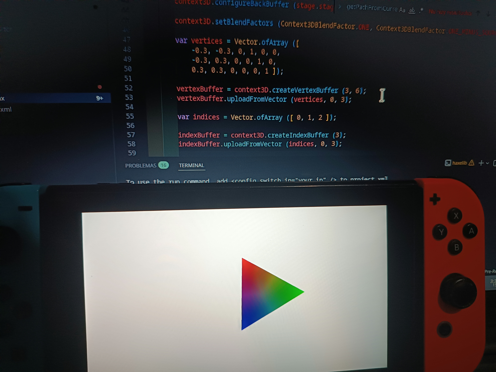

# EXPERIMENTAL FORK FOR THE NINTENDO SWITCH

**This fork is based on the commit ``68107ee`` (From  Sep 18, 2025) of the original [Lime](https://github.com/openfl/lime)**



## Examples

### Capture an OpenFL project from a real Nintendo Switch:


### OpenFL Samples -> HelloTriangle:



### HaxeFlixel 6.1.2 running [Mode](https://haxeflixel.com/demos/Mode) on the Nintendo Switch:

[See the video on YouTube](https://youtu.be/8hwZIDWoHnI), or get the build file [here](https://github.com/Slushi-Github/lime-nx/releases/tag/HaxeFIxelMode)

### Switch Funkin' ([Psych Engine](https://github.com/ShadowMario/FNF-PsychEngine) 1.0.4), real FNF' on Nintendo Switch!
- [GitHub](https://github.com/Slushi-Github/Switch-Funkin)
- Gamebanana:
	> [](https://gamebanana.com/tools/21807)

## How to use

You need to install [Haxe](https://haxe.org/download) and [DevKitPro stuff](https://devkitpro.org/wiki/Getting_Started)

Once you have Haxe and DevKitPro with DevKitA64 installed, install the dependencies:

(If you are on Linux/macOS, you will most likely need to use `sudo dkp-pacman` instead of `pacman`)

```bash
pacman -S --needed 
switch-bzip2 
switch-cmake 
switch-curl 
switch-flac 
switch-freetype 
switch-glad 
switch-glm 
switch-harfbuzz 
switch-libdrm_nouveau 
switch-libjpeg-turbo 
switch-libmodplug 
switch-libogg 
switch-libopus 
switch-libpng 
switch-libvorbis 
switch-libvorbisidec 
switch-libwebp 
switch-mesa 
switch-mpg123 
switch-openal-soft 
switch-opusfile 
switch-pkg-config 
switch-sdl2 
switch-sdl2_gfx 
switch-sdl2_image 
switch-sdl2_mixer 
switch-sdl2_net 
switch-sdl2_ttf 
switch-tools 
switch-zlib
```

Then just install this fork with:

```bash
haxelib git lime https://github.com/Slushi-Github/lime-nx.git
```

install the dependencies for Lime:

```bash
haxelib install format
haxelib install hxp
```

And my fork of hxcpp:

```bash
haxelib git hxcpp https://github.com/Slushi-Github/hxcpp-nx.git
```

And and generate your Lime library:

```bash
haxelib run lime rebuild switch
```

For now, you must put this in your `project.xml`, otherwise your program will crash when you open it:

```xml
<haxedef name="lime-opengl" if="switch" />
<haxedef name="lime-cairo" value="false" if="switch" />
<set name="LIME_CAIRO" value="0" if="switch" />
<set name="LIME_OPENGL" value="1" if="switch" />
```

and it is also advisable to include this:

```xml
<!--Switch-specific-->
<window if="switch" orientation="landscape" fullscreen="true" width="0" height="0" resizable="false" hardware="true" />
```

And now you can compile your project!:

```bash
haxelib run lime build switch
```

For use the run command, you need to add this to your `project.xml`:

```xml
<config:switch ip="192.168.x.x" if="switch"/>
```

or use:

```bash
haxelib run lime run switch --ip=192.168.x.x
```

If the IP is not set, nxlink (The program that sends the project to the Switch) will try to find the Switch automatically if your console is waiting for it, **but is recommended to set the IP!**

For add more libs (which must be installed in DevKitPro) to the MakeFile (the one responsible for generating the final executable) you need to add this to your `project.xml`:

```xml
<config:switch libs="yourLib1, yourLib2" if="switch"/>
```

## Use with the Lime VSCode extension

Just add the following to your VSCode settings JSON file or the `settings.json` file in your project folder:

```json
"lime.targets": [
    {
        "name": "switch",
        "label": "Switch",
        "enabled": true
    }
],

"lime.targetConfigurations": [
    {
        "label": "Switch",
        "target": "switch",
        "args": [
            "-DHX_NX"
        ],
        "enabled": true
    },
    {
        "label": "Switch / Release",
        "target": "switch",
        "args": [
            "-DHX_NX"
        ],
        "enabled": true
    },
    {
        "label": "Switch / Debug",
        "target": "switch",
        "args": [
            "-debug",
            "-DHX_NX"
        ],
        "enabled": true
    },
    {
        "label": "Switch / Final",
        "target": "switch",
        "args": [
            "-final",
            "-DHX_NX"
        ],
        "enabled": true
    }
]
```

Then the defines for the Switch target (`HX_NX`, `switch`) will be valid in your project.

----

[](LICENSE.md) [](http://lib.haxe.org/p/lime) [](https://github.com/openfl/lime/actions) [](https://community.openfl.org/c/lime/19) [](https://discordapp.com/invite/tDgq8EE)

Lime
====

Lime is a flexible, lightweight layer for Haxe cross-platform developers.

Lime supports native, Flash and HTML5 targets with unified support for:

 * Windowing
 * Input
 * Events
 * Audio
 * Render contexts
 * Network access
 * Assets

Lime does not include a renderer, but exposes the current context:

 * Cairo
 * Canvas
 * DOM
 * Flash
 * GL

The GL context is based upon the WebGL standard, implemented for both OpenGL and OpenGL ES as needed.

Lime provides a unified audio API, but also provides access to OpenAL for advanced audio on native targets.


License
=======

Lime is free, open-source software under the [MIT license](LICENSE.md).


Installation
============

First, install the latest version of [Haxe](http://www.haxe.org/download).

Then, install Lime from Haxelib and run Lime's setup command.

    haxelib install lime
    haxelib run lime setup


Development Builds
==================

When there are changes, Lime is built nightly. Builds are available for download [here](https://github.com/Slushi-Github/lime-nx/actions?query=branch%3Adevelop+is%3Asuccess).

To install a development build, use the "haxelib local" command:

    haxelib local lime-haxelib.zip


Building from Source
====================

**DO NOT FOLLOW THIS, USE THE ABOVE INSTEAD**

1. Clone the Lime repository, as well as the submodules:

        haxelib git lime https://github.com/https://github.com/Slushi-Github/lime-nx/

2. Install required dependencies:

        haxelib install format
        haxelib install hxp

3. Copy the ndll directory from the latest [Haxelib release](https://lib.haxe.org/p/lime/), or see [project/README.md](project/README.md) for details about building native binaries.

4. After any changes to the [tools](tools) or [lime/tools](src/lime/tools) directories, rebuild from source:

        lime rebuild tools

5. To switch away from a source build:

        haxelib set lime [version number]


Sample
======

You can build a sample Lime project with the following commands:

    lime create HelloWorld
    cd HelloWorld
    lime test neko

You can also list other projects that are available using "lime create".


Targets
=======

Lime currently supports the following targets:

    lime test windows
    lime test mac
    lime test linux
    lime test android
    lime test ios
    lime test html5
    lime test flash
    lime test air
    lime test neko
    lime test hl
    lime test switch

Desktop builds are currently designed to be built on the same host OS


Join the Community
==================

Have a question? Want a new place to hang out?

 * [Forums](https://community.openfl.org/c/lime/19)
 * [Discord](https://discordapp.com/invite/tDgq8EE)
